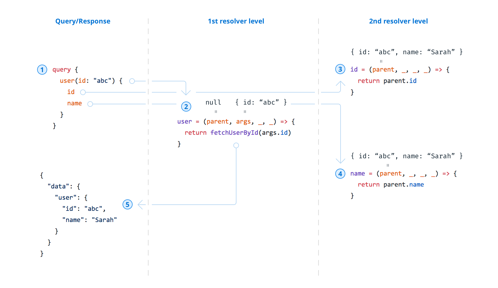

## Technologies

- nexus - used for generating tyesage GraphQL schema
- apollo-server - used for creating web server with graphQl functionalities

## Graphql query execution

## Prisma

Prisma Client exposes a CRUD API for the models in your schema for you to read and write in your database. These methods are auto-generated based on your model definitions in schema.prisma.

#### Important Links

https://stackoverflow.com/questions/65034164/can-graphql-schema-be-used-as-database-schema-definition

Fluent API - https://www.prisma.io/docs/concepts/components/prisma-client/relation-queries#fluent-api

NexusSDL converter - https://nexusjs.org/converter
